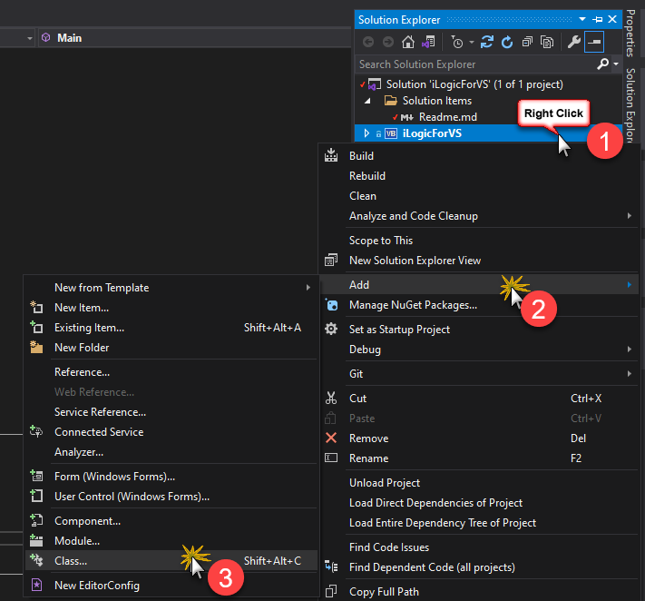
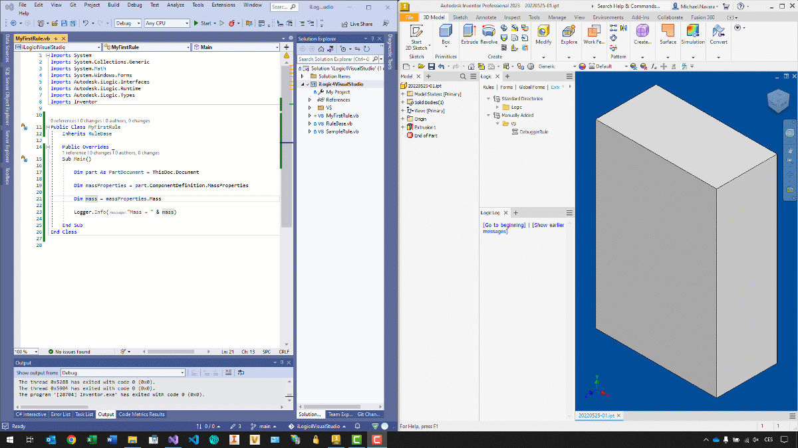

# iLogic for Visual Studio
This project is designed for Autodesk Inventor iLogic code creation and debugging.
With minimal updates it works for all actual versions of Inventor.

## Requirements
1) Default configuration assumes the Autodesk Inventor 2020 
is installed on your computer.
Otherwise you need to update [Project references](#project-references) for Inventor and iLogic DLL's

2) Visual Studio must be installed


## Setup
Download or clone repository to your local computer. Then open it in Visual Studio.

### Project references
This project uses iLogic DLL files from its default location. 

- Autodesk.iLogic.Interfaces.dll
- Autodesk.iLogic.Runtime.dll
- Autodesk.iLogic.Types.dll

You need to check if it is loaded correctly.
Default location is 
> *C:\Program Files\Autodesk\Inventor 2020\Bin\\*

Reference to *Autodesk.Inventor.Interop.dll* can be made from Inventor installation path or directly from GAC.
> C:\Program Files\Autodesk\Inventor 2020\Bin\Public Assemblies\Autodesk.Inventor.Interop.dll


In both cases it is necessary to check if this referenced assembly has set 
> Embed Interop Types = False


### Rule template
For easy creation of new iLogic rule is there a Visual Studio file template. 
Download and copy this rule template to your Visual Studio item templates location

> *%USERPROFILE%\Documents\Visual Studio 2019\Templates\ItemTemplates\\*

### Debugger rule
Add DebuggerRule.iLogicVb to your external rules list in Inventor. Then you need to setup the rule.
All settings are located in Main() function at the top of the rule.

```vb.net
Sub Main()
    ' Path to directory with build
    Dim buildDir = "D:\GIT\iLogic4VisualStudio\iLogic4VisualStudio\bin\Debug"

    ' File name of compiled DLL file
    Dim dllFileName = "iLogic4VisualStudio.dll"

    'Name of the class with rule to debug
    Dim ruleName = "SampleRule"

    Dim testedRule As Object = GetTestedRule(buildDir, dllFileName, ruleName)
    If testedRule Is Nothing Then Return

    InitializeiLogicObjects(testedRule)

    'Execute rule Main()
    Logger.Info("Starting rule: {0}", ruleName)
    Call testedRule.Main()
End Sub
```

1) **buildDir** - This variable contains the path to build directory of this VS project.


2) **dllFileName** - This variable contains the file name of the compiled DLL file. 
You can keep it unchanged by default.

3) **ruleName** - This variable contains the name of the class which contains a rule code. 
This can be:
- full class name including namespace 
  - ```Dim ruleName = "iLogic4VisualStudio.SampleRule"```
- class name only when the name is unique within this project 
  - ```Dim ruleName = "SampleRule"```

# Coding
This part describes how to 
- [Create new rule](#create-new-rule)
- [Add some code](#add-some-code)
- [Debug rule](#debug-rule)


## Create new rule
New rule can be dreated from iLogic rule template or from scratch as new VB.NET class

### From iLogic rule template
If you have installed iLogic template rule, then only create new class from this template. All minimal requirements are included.

### From scratch
If you don't have installed iLogic rule template, you can use default template for empty VB.NET class


In this case you need to inherit this class from ```RuleBase``` class because this class contains necesary basic functionality

This is the minimal code for new iLogic rule

```vb.net
Public Class MyNewRule
    Inherits RuleBase

    Public Overrides Sub Main()
        'Your code here
    End Sub
End Class
```

## Add some code
Simple rule can be written in ```Main()``` method body only. 

```vb.net
Public Class ShowMessage
    Inherits RuleBase

    Public Overrides Sub Main()
        MsgBox("Show some message")
    End Sub
End Class
```

For larger code the ```Main()``` method is mandatory as entry point, but the code can be split to more methods and functions.
```vb.net
Public Class ShowMessage
    Inherits RuleBase

    Public Overrides Sub Main()
        Dim message As String = BuildMessage()
        MsgBox(message)
    End Sub

    Private Function BuildMessage() As String
        Return String.Format("Now is: {0}", DateTime.Now)
    End Function
End Class
```

Nested types are aslo supported
```vb.net
Public Class ShowMessage
    Inherits RuleBase

    Public Overrides Sub Main()
        Dim messageBuilder As MessageBuilder = New MessageBuilder
        Dim message As String = messageBuilder.BuildMessage()
        MsgBox(message)
    End Sub

    Class MessageBuilder

        Public Function BuildMessage() As String
            Return String.Format("Now is: {0}", DateTime.Now)
        End Function

    End Class
End Class
```


### Debug rule
Before you can debug your code, you need to build this project.
Then you open Inventor and verify you have set correct rule name in DebuggerRule.iLogicVb 
> For above examples:
>  
> ```Dim ruleName = "ShowMessage"```

You can attach Visual Studio debugger to Inventor process and then you can set break points and other powerful debuging tools of VS.

Start the ```DebuggerRule``` to execute the code. 



### Extract iLogic code
In this project the code is written as full VB.NET class. For iLogic you need only part of this source code.
To extract iLogic code you can copy the appropriate part of code.

- For simple rules it is body/content of ```Main()``` method.
- For complex code you need to copy almost all code from rule class. 
  But **without** the ```Public Overrides``` keywords of ```Main()``` method.

## Limitations
This VS project can be used for all types of external rules. But for internal rules it has some limitations.

### Parameters
Because iLogic compiler creates some wrappers for parameters used directly by its names, it is NOT possible to use this access

|  NOT Possible        |           This works              |
|----------------------|-----------------------------------| 
| ```MyParam = 2``` | ```Parameter("MyParam") = 3```|

